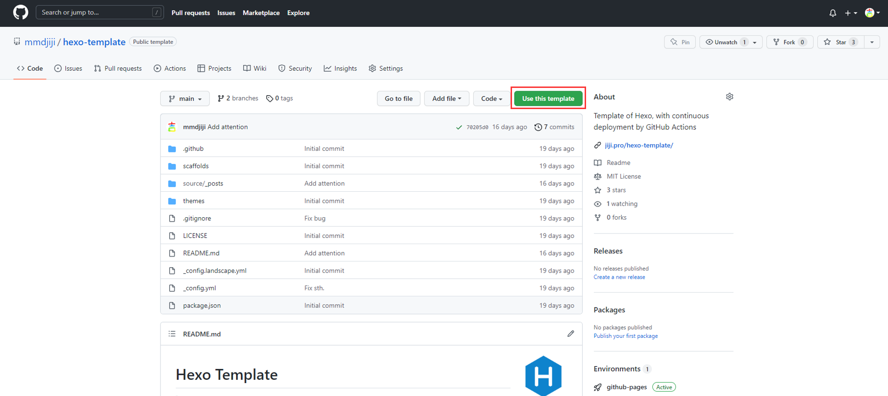
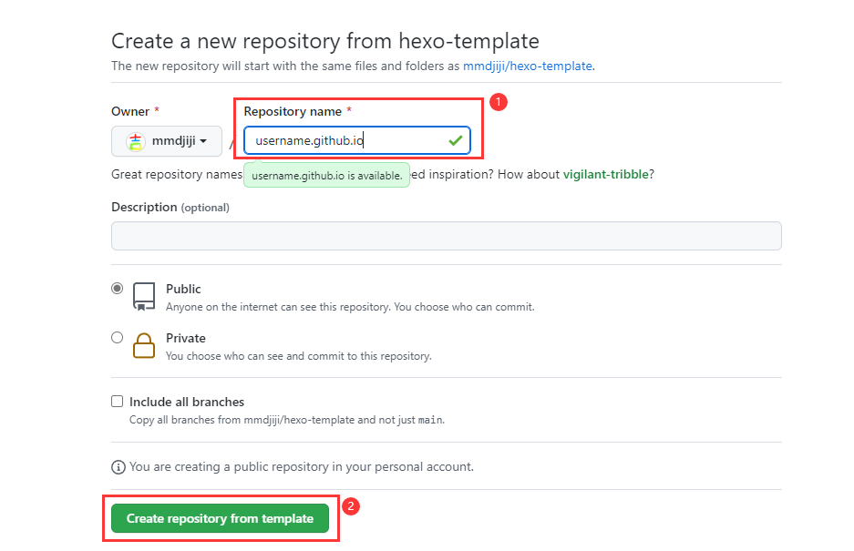
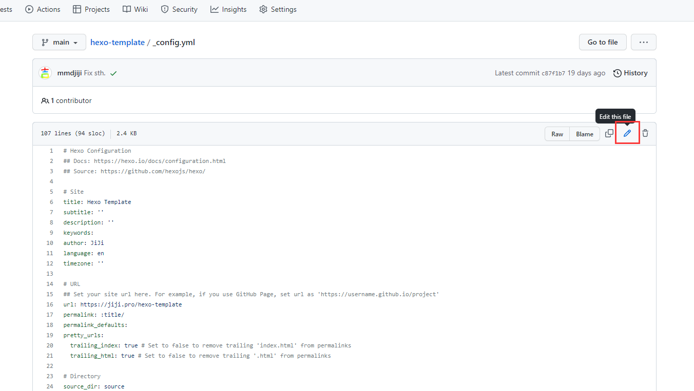
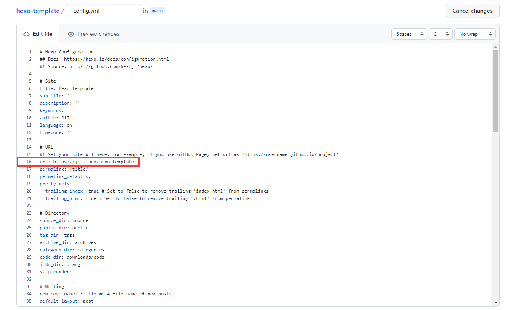
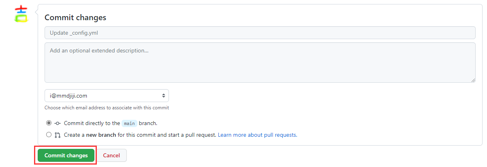
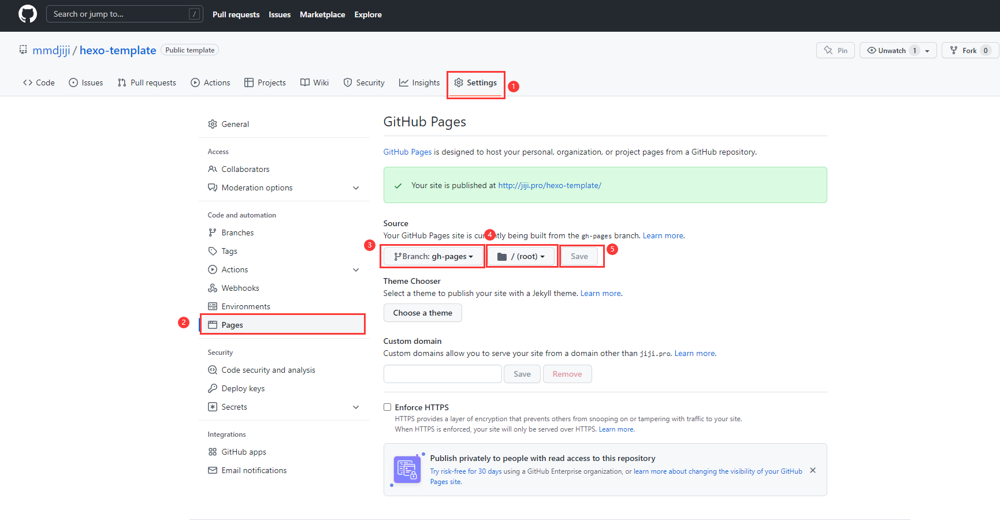
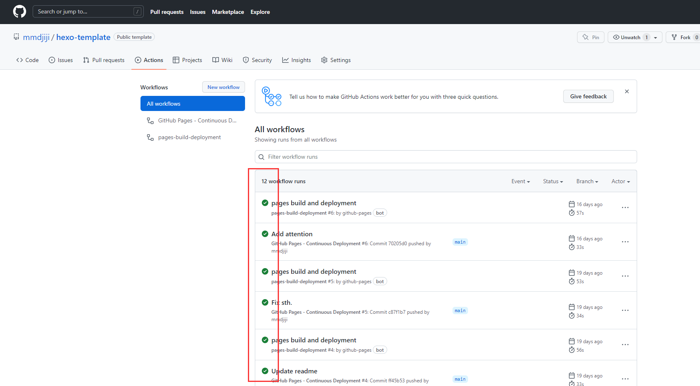
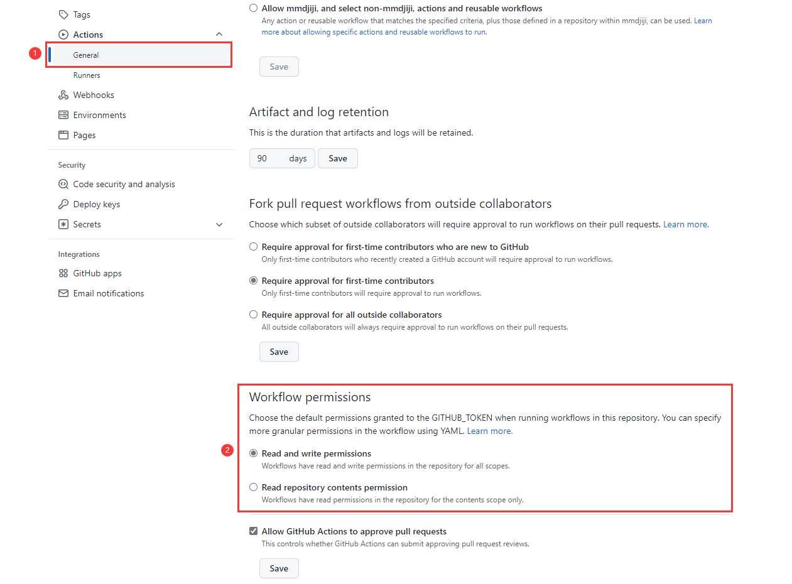

# Create a blog

An elegant blog should meet the following three requirements:

1. Easy to new / edit / delete each article
2. Easy to deploy and migrate, and not easy to be hacked
3. Could be edited everywhere with every device

Okay, let's start!

## Sign up a [GitHub](https://github.com) account

If you haven't learned how to use GitHub or even haven't signed it up, please read [GitHub](../../tools-you-need-to-learn/github/).

## Use the template

Then goto [mmdjiji/hexo-template](https://github.com/mmdjiji/hexo-template), and click `Use this template` button.



After clicking the button, you should name your repository with `username.github.io`, and the `username` is your true username. For example, my username is `mmdjiji`, so I need to type `mmdjiji.github.io` in it.



!!!note
    You can use other repository name either, but there are something different after that.

## Modify two lines of code in `_config.yml`

Creating repository wouldn't take a minute, and you will be redirected to the repository main page, find the file named `_config.yml` and attach it, then click the `edit` button.





The first thing you need to edit is `url` (line 16), if you use the style like `username.github.io`, you just need to type `https://username.github.io/` here.

```yml
url: https://username.github.io/
```

But if your repository name isn't `username.github.io`, you need to type like that (replace `repo_name` with actual repository name):
```yml
url: https://username.github.io/repo_name
```

Another you will modify is to **delete** the last line of `_config.yml`, which likes that:
```yml
root: /hexo-template
```

It should be noted that if your repository name doesn't like `username.github.io`, you need to type like that (replace `repo_name` with actual repository name):
```yml
root: /repo_name
```

Okay, that's all. Click `Commit changes` to save and push it to the remote server! Now you can have a cup of coffee because the server need minutes to deploy it.



## Set up GitHub Pages

After a cup of coffee (or Chinese tea), let's set up the `GitHub Pages`. Choose `gh-pages` branch and save like the following picture:



If there are nothing wrong, your `Actions` will be filled with green check, but not red check. You can goto `https://username.github.io` (or `https://username.github.io/repo_name`) now!



## Exception

If you meet red check and that means failed (it wouldn't be happened as usual), check the under option:



Always keep the workflow at `Read and write permissions`.